# CYCLE 16C: KIRKLAND & ELLIS NETWORK TOPOLOGY
## Complete Power Network Analysis

---

## NETWORK OVERVIEW

| Metric | Value |
|--------|-------|
| **Total Nodes** | 66 |
| **Total Edges** | 100 |
| **Central Node** | Kirkland & Ellis LLP |
| **Centrality Score** | 39% of all edges |
| **Epstein-Relevant Nodes** | 11 |
| **High Power Nodes (≥0.85)** | 14 |

---

## NETWORK VISUALIZATION

```mermaid
graph TB
    subgraph "CENTRAL HUB"
        KE[("Kirkland & Ellis<br/>$8.8B Revenue<br/>#1 Global Law Firm")]
    end
    
    subgraph "DOJ CONTROL"
        BARR[William Barr<br/>AG x2]
        ROSEN[Jeffrey Rosen<br/>Deputy AG]
        FILIP[Mark Filip<br/>Deputy AG]
        BENC[Brian Benczkowski<br/>AAG Criminal]
        ACOSTA[Alexander Acosta<br/>US Attorney SDFL]
        COX[Erin Nealy Cox<br/>US Attorney NDTX]
        KHUZ[Robert Khuzami<br/>Deputy SDNY]
    end
    
    subgraph "SCOTUS"
        KAV[Brett Kavanaugh<br/>Justice]
    end
    
    subgraph "WHITE HOUSE"
        CIP[Pat Cipollone<br/>Counsel Trump]
        EGG[Neil Eggleston<br/>Counsel Obama]
    end
    
    subgraph "EPSTEIN CASE"
        JE[Jeffrey Epstein<br/>Deceased 2019]
        DBARR[Donald Barr<br/>Hired Epstein 1974]
        LEF[Jay Lefkowitz<br/>Lead Defense]
        STARR[Ken Starr<br/>Defense Team]
        DERSH[Alan Dershowitz<br/>Defense Team]
    end
    
    subgraph "NEW DOC REVELATIONS"
        RUEM[Kathryn Ruemmler<br/>Uncle Jeffrey]
        KARP[Brad Karp<br/>Paul Weiss Chair]
        LUTN[Howard Lutnick<br/>Commerce Sec]
    end
    
    subgraph "FINANCIAL INSTITUTIONS"
        JPM[JPMorgan<br/>$365M Settlement]
        DB[Deutsche Bank<br/>$75M Settlement]
        GS[Goldman Sachs<br/>Ruemmler CLO]
    end
    
    subgraph "BOEING CASE"
        BOEING[Boeing<br/>346 Deaths<br/>Sweetheart DPA]
    end
    
    KE --> BARR
    KE --> ROSEN
    KE --> FILIP
    KE --> BENC
    KE --> ACOSTA
    KE --> COX
    KE --> KHUZ
    KE --> KAV
    KE --> CIP
    KE --> EGG
    KE --> LEF
    KE --> STARR
    
    BARR --> JE
    ACOSTA --> JE
    LEF --> JE
    STARR --> JE
    DERSH --> JE
    DBARR --> JE
    DBARR --> BARR
    
    RUEM --> JE
    RUEM --> GS
    KARP --> JE
    LUTN --> JE
    
    JE --> JPM
    JE --> DB
    KHUZ --> DB
    
    KE --> BOEING
    FILIP --> BOEING
    COX --> BOEING
    COX -.-> KE
    
    classDef central fill:#ff0000,color:#fff
    classDef doj fill:#1a5276,color:#fff
    classDef epstein fill:#922b21,color:#fff
    classDef financial fill:#1e8449,color:#fff
    classDef boeing fill:#f39c12,color:#fff
    
    class KE central
    class BARR,ROSEN,FILIP,BENC,ACOSTA,COX,KHUZ doj
    class JE,DBARR,LEF,STARR,DERSH,RUEM,KARP,LUTN epstein
    class JPM,DB,GS financial
    class BOEING boeing
```



---

## THE KIRKLAND & ELLIS REVOLVING DOOR

### Complete Career Paths

#### William Barr (Power Score: 0.98)
```
Kirkland Partner → AG (Bush I) → Kirkland Partner → AG (Trump) → Kirkland Partner
                                                      ↓
                                            [Oversaw Epstein death investigation]
                                            [Father hired Epstein at Dalton 1974]
```

#### Robert Khuzami (Power Score: 0.88)
```
AUSA SDNY → Deutsche Bank GC → SEC Director → Kirkland Partner → Deputy SDNY → Guggenheim CLO
                ↓                                 ↓
        [Epstein's bank 2013-2019]       [Paid $11.1M in one year]
```

#### Erin Nealy Cox (Boeing Prosecutor)
```
Government → US Attorney NDTX → [Boeing DPA signed her last day] → Kirkland Partner
                                           ↓
                               [Welcomed by Mark Filip - Boeing defense lead]
```

#### Brian Benczkowski (Classic Pattern)
```
Kirkland Partner → AAG Criminal Division → Kirkland Partner
        ↓                    ↓                     ↓
    [Corporate      [Controlled federal    [Same clients,
     clients]        prosecutions]          new leverage]
```

---

## EPSTEIN CASE CONTROL CHAIN

### Step 1: Representation
| Entity | Person | Role |
|--------|--------|------|
| Kirkland & Ellis | Jay Lefkowitz | Lead attorney, NPA negotiations |
| Kirkland & Ellis | Ken Starr | Defense team |

### Step 2: Prosecution Decision
| Entity | Person | Outcome |
|--------|--------|---------|
| DOJ SDFL | Alexander Acosta (Kirkland) | Approved NPA, immunity for 4 co-conspirators |

**Acosta Statement:** *"I was told Epstein belonged to intelligence."*

### Step 3: Oversight During Death
| Entity | Person | Role |
|--------|--------|------|
| DOJ | William Barr (Kirkland) | AG overseeing MCC during death |

**Family Connection:** Donald Barr hired Epstein at Dalton School in 1974

### Step 4: Prosecution Scope
| Outcome | Details |
|---------|---------|
| Total names in documents | 50+ |
| Prosecutions | 1 (Maxwell) |
| Prosecution rate | 2% |

---

## NEW DOCUMENT REVELATIONS (Jan 30, 2026 Release)

### Kathryn Ruemmler - "Uncle Jeffrey"
| Role | Organization |
|------|--------------|
| White House Counsel | Obama Administration |
| Partner | Latham & Watkins |
| Chief Legal Officer | Goldman Sachs (current) |
| Legal Adviser | Jeffrey Epstein |

**Email Quote:** *"Am totally tricked out by Uncle Jeffrey today! Jeffrey boots, handbag, and w=tch!"*

**Gifts Documented:**
- $9,400 Hermes handbag
- Custom boots
- Watch  
- $10,000 Bergdorf Goodman gift cards
- Spa treatments
- First-class tickets to Europe

### Brad Karp - Paul Weiss Chairman
| Connection | Details |
|------------|---------|
| Dinners | Attended exclusive events at Epstein's mansion |
| Quote | *"I can't thank you enough for including me in an evening I'll never forget"* |
| Favors | Asked Epstein help for son's job on Woody Allen film |
| Golf Club | Epstein asked Bannon to get Karp into Augusta |

### Howard Lutnick - Commerce Secretary
| Connection | Details |
|------------|---------|
| Current Role | Trump Commerce Secretary |
| Epstein Connection | Planned visit to Epstein's island per DOJ files |

---

## FINANCIAL INSTITUTION CONNECTIONS

### JPMorgan Chase
| Period | 2000-2013 |
|--------|-----------|
| Settlement | $365 million |
| Connection | Epstein accounts, loans |

### Deutsche Bank
| Period | 2013-2019 |
|--------|-----------|
| Settlement | $75 million |
| Internal Quote | Banker to Fortune: *"He lied about everything"* |
| Kirkland Connection | Robert Khuzami was General Counsel during Epstein client period |

### Goldman Sachs
| Connection | Kathryn Ruemmler is current CLO |
|------------|-------------------------------|
| Ruemmler History | Epstein's legal adviser, "Uncle Jeffrey" |

---

## BOEING 737 MAX CASE STUDY

### Deaths: 346
- Lion Air: 189 (October 2018)
- Ethiopian Airlines: 157 (March 2019)

### The Pattern
```
┌─────────────────────────────────────────────────────────────────┐
│                    BOEING PROSECUTION                           │
├─────────────────────────────────────────────────────────────────┤
│  Defense: Kirkland & Ellis (Mark Filip)                         │
│  Prosecutor: Erin Nealy Cox (US Attorney NDTX)                  │
├─────────────────────────────────────────────────────────────────┤
│  OUTCOME:                                                       │
│  ✗ No guilty plea required                                      │
│  ✗ Zero executives charged                                      │
│  ✗ No compliance monitor                                        │
│  ✓ DPA signed Cox's last day in office (Jan 7, 2021)           │
├─────────────────────────────────────────────────────────────────┤
│  REVOLVING DOOR:                                                │
│  Cox joins Kirkland as partner 5 months later                   │
│  Welcomed to firm by Mark Filip (Boeing defense lead)           │
└─────────────────────────────────────────────────────────────────┘
```

**Expert Assessment:** *"One of the worst deferred prosecution agreements I have seen"* - Prof. John Coffee, Columbia Law

---

## GOVERNMENT PENETRATION SUMMARY

### By Branch

| Position | Count | Names |
|----------|-------|-------|
| **Supreme Court** | 1 | Kavanaugh |
| **Attorneys General** | 2 | Barr, Bork |
| **Deputy AGs** | 2 | Rosen, Filip |
| **Cabinet Secretaries** | 3 | Acosta, Azar, Bolton |
| **White House Counsel** | 2 | Cipollone, Eggleston |
| **Solicitors General** | 3 | Clement, Starr, Wall |
| **US Attorneys** | 3 | Acosta, Cox, Kasulis |
| **FTC Officials** | 8 | Muris, Wilson, Mohr, + |
| **SEC Officials** | 2+ | Khuzami, + |
| **Federal Judges** | 2 | Bress, Castillo |

### Bipartisan Access
- **Republican:** Barr, Acosta, Kavanaugh, Bolton, Azar, Cipollone...
- **Democrat:** Eggleston, Zaidi, Krishnamoorthi, Madigan...

---

## FIRM'S OWN ACKNOWLEDGMENT

> *"Our philosophy is that an agency can never be led by too many lawyers from Kirkland & Ellis."*
> — Claire Murray, Principal Deputy Associate AG

> *"These Kirkland partners have, while in government service, authored policies and regulations that remain central to the evaluation and disposition of corporate and anti-corruption cases."*
> — Kirkland & Ellis Website

---

## CONCLUSIONS

### Network Function
Kirkland & Ellis operates as the **legal infrastructure layer** for a power network that includes:
- Financial institutions (JPMorgan, Deutsche Bank, Goldman Sachs)
- Government positions (DOJ, FTC, SEC, White House, SCOTUS)
- Protected individuals (Epstein and associates)
- Major corporations (Boeing, Fox, BP)

### Control Mechanism
1. Place alumni in prosecution positions
2. Represent clients needing protection
3. Secure favorable outcomes
4. Welcome prosecutors back to firm
5. Repeat across administrations

### Epstein Case: Complete Control
- **Representation:** Kirkland represented Epstein
- **Prosecution:** Kirkland alumni approved NPA
- **Oversight:** Kirkland alumni AG during death
- **Result:** 2% prosecution rate

### Boeing Case: Same Pattern
- **Defense:** Kirkland represented Boeing
- **Prosecution:** Cox gave sweetheart DPA
- **Revolving Door:** Cox joined Kirkland 5 months later
- **Result:** Zero executives charged for 346 deaths

---

## NODE ASSESSMENT

| Node | Score | Status |
|------|-------|--------|
| Kirkland & Ellis | 1.0000 | **LEGAL IMMUNITY ARCHITECTURE** |
| William Barr | 0.9800 | Critical Epstein oversight |
| Brett Kavanaugh | 0.9500 | Lifetime SCOTUS appointment |
| Mark Filip | 0.9200 | Boeing pattern controller |
| Alexander Acosta | 0.9000 | Epstein NPA approver |
| Robert Khuzami | 0.8800 | Deutsche Bank/SEC/SDNY revolving door |
| Kathryn Ruemmler | 0.8500 | "Uncle Jeffrey" - Goldman CLO |

---

*Data Sources: DOJ Epstein Files (Jan 30, 2026 release), Wikipedia, LittleSis, ProPublica Trump Town, Legal 500, Chambers, Corporate Crime Reporter, Bloomberg Law, Financial Times, CBS News, firm disclosures, court records*
